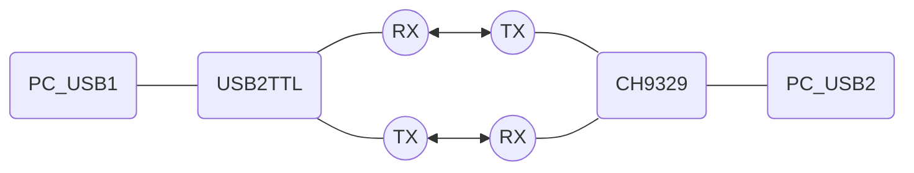
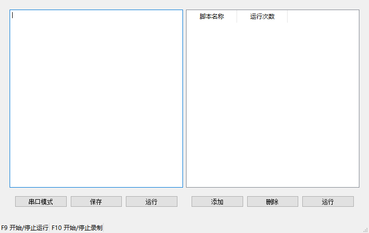

```
按F10开始录制脚本，再次按下F10结束录制  
按F9测试运行一次，点击保存可以将刚才录制的脚本保存起来  
点击添加选择刚才的录制脚本，双击运行次数设置多次运行，默认只运行一次
点击运行,运行过程中点击F9停止运行
```
# CH9329串口模式连接方式

```mermaid
    graph LR
    A(PC_USB1) --- C(USB2TTL)
    C --- E((RX)) <--> H((TX)) --- D(CH9329) 
    C --- F((TX)) <--> G((RX)) --- D(CH9329) --- B(PC_USB2)
```
