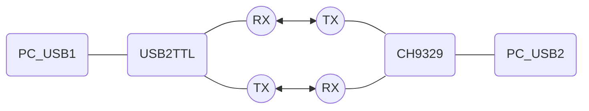
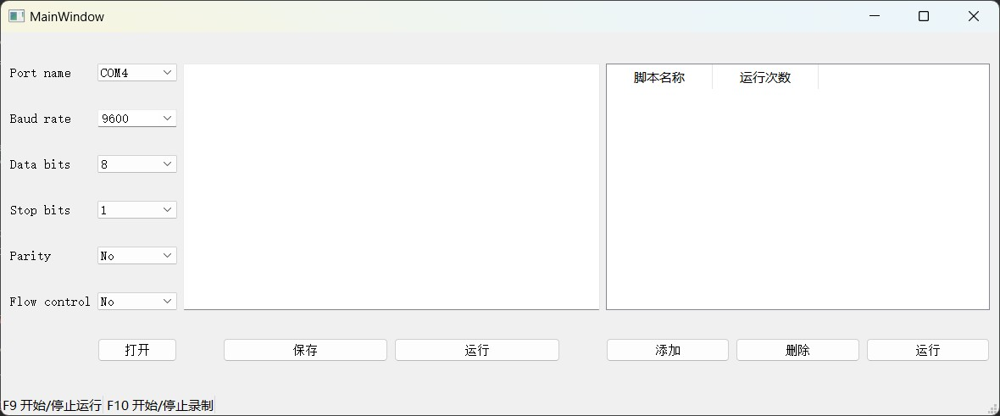

```
按F10开始录制脚本，再次按下F10结束录制，按F9运行一次
```


```mermaid
    graph LR
    A(PC_USB1) --- C(USB2TTL)
    C --- E((RX)) <--> H((TX)) --- D(CH9329) 
    C --- F((TX)) <--> G((RX)) --- D(CH9329) --- B(PC_USB2)
```
